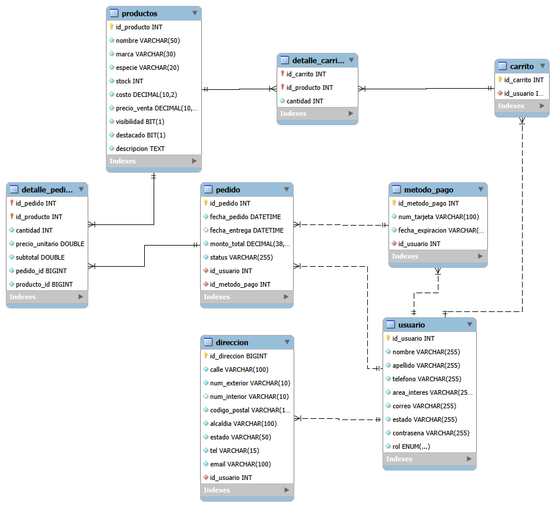

<table width="100%" border="0" cellspacing="0" cellpadding="0" style="width:100% !important; border-collapse:collapse; padding:0; margin:0; table-layout: fixed;">
  <tr style="padding:0; margin:0;">
    <td align="center" width="100%" style="width:100% !important; background-color: #f9f3dd; padding: 0 !important; margin: 0 !important;">
      
    </td>
  </tr>
</table>

 

<h1 align="center">🐂 El Toro Forrajero - Backend (API REST)</h1>

    
    
    
    
    
    

    <i>Núcleo de servicios y lógica de negocio para la plataforma e-commerce especializada en el sector pecuario.</i>

## 🚀 Enlaces de Interés
* **Frontend del Proyecto:** [Repositorio del Frontend](https://github.com/D-a-v-i-d-Vargas/Toro-Forrajero-Ecommerce)
* **Plataforma en Producción (AWS EC2):** [El Toro Forrajero - En Vivo](https://toro-forrajero.duckdns.org)

---

## 🌾 Visión General del Backend

Este repositorio contiene la arquitectura de servidor para **El Toro Forrajero**, un ecosistema digital desarrollado por el **404 Error Club** (Generation México) que conecta directamente a proveedores de insumos pecuarios con pequeños productores y ganaderos.

El backend está construido bajo una arquitectura limpia en capas utilizando **Spring Boot**, gestionando la persistencia mediante **Spring Data JPA y Hibernate** conectada a una base de datos relacional en **MySQL**, manejando dependencias con **Gradle**, y se encuentra desplegado en una instancia **AWS EC2** para garantizar alta disponibilidad y seguridad en las transacciones.

---

## 🛠️ Stack Tecnológico del Servidor

| ⚙️ Núcleo y Framework | 🗄️ Persistencia y Base de Datos | ☁️ Infraestructura y Despliegue |
| :---: | :---: | :---: |
|  **Java JDK 17** |  **MySQL Database** |  **AWS EC2 Instance** |
|  **Spring Boot / Security** |  **Spring Data JPA** |  **Gradle Build Tool** |

---

## 📂 Arquitectura del Proyecto por Capas

El proyecto implementa una estricta separación de responsabilidades organizada en los siguientes paquetes principales:

* **`controller`**: Controladores REST encargados exclusivamente de recibir las peticiones HTTP del cliente y retornar respuestas estructuradas mediante `ResponseEntity`.
* **`service`**: Capa donde reside el corazón de la lógica de negocio (ej. cifrado de contraseñas, reglas de stock, procesamiento de carritos y pedidos).
* **`repository`**: Interfaces de persistencia apoyadas en Spring Data JPA para la comunicación directa con la base de datos relacional.
* **`model`**: Entidades JPA que representan las tablas de la base de datos en código orientado a objetos.
* **`dto`** *(Data Transfer Objects)*: Objetos diseñados para transferir únicamente la información necesaria en cada operación, optimizando el rendimiento y protegiendo la estructura interna.

---

## 🗄️ Modelo Relacional de la Base de Datos

La información del sistema se encuentra estructurada en distintas tablas interrelacionadas mediante llaves primarias y foráneas (`usuario`, `direccion`, `carrito`, `detalle-carrito`, `metodo-pago`, `pedido`, `detalle-pedido` y `productos`).

    

---

## 🔌 Documentación de Endpoints (Controllers)

A continuación se enlistan los controladores principales implementados en el sistema y sus rutas base:

### 1. Autenticación (`/auth`)
Gestiona el acceso seguro al sistema y la generación de tokens de sesión.
* `POST /auth/login` - Valida credenciales de usuario mediante `UserDetailsService` y codificación de contraseñas, retornando un token de acceso.

### 2. Usuarios (`/api/usuarios`)
* `GET /api/usuarios` - Lista todos los usuarios registrados.
* `GET /api/usuarios/{id}` - Obtiene un usuario por su identificador único.
* `POST /api/usuarios` - Registra un nuevo usuario cifrando su contraseña.
* `POST /api/usuarios/login` - Autenticación alternativa basada en respuestas JSON.
* `PUT /api/usuarios/{id}` - Actualiza la información de un usuario.
* `DELETE /api/usuarios/{id}` - Da de baja a un usuario del sistema.

### 3. Productos (`/api/productos`)
* `GET /api/productos` - Lista todo el catálogo de insumos disponibles.
* `GET /api/productos/{id}` - Obtiene la ficha detallada de un producto.
* `POST /api/productos` - Permite al administrador dar de alta un nuevo producto.
* `PUT /api/productos/{id}` - Modifica los datos de un producto existente.
* `DELETE /api/productos/{id}` - Elimina un producto del catálogo.
* `GET /api/productos/buscar` - Filtra productos de manera dinámica por marca y/o especie animal (ovinos, bovinos, porcinos, aves).
* `GET /api/productos/destacados` - Recupera los productos con mayor relevancia comercial.

### 4. Carrito de Compras (`/api/carrito` y `/api/detalle-carrito`)
* `GET /api/carrito/usuario/{usuarioId}` - Obtiene el carrito sincronizado de un usuario.
* `GET /api/detalle-carrito/{idCarrito}/detalles` - Consulta los ítems contenidos en el carrito.
* `POST /api/detalle-carrito/{idCarrito}/producto/{idProducto}` - Agrega un producto al carrito con su respectiva cantidad.
* `PUT /api/detalle-carrito/{idCarrito}/producto/{idProducto}` - Actualiza la cantidad de un artículo en tiempo real.
* `DELETE /api/detalle-carrito/{idCarrito}/producto/{idProducto}` - Remueve un producto específico del carrito.
* `DELETE /api/detalle-carrito/{idCarrito}/vaciar` - Vacía por completo el carrito de compras.

### 5. Direcciones (`/api/direcciones`)
* `GET /api/direcciones/{idUsuario}` - Muestra las direcciones de entrega asociadas a un usuario.
* `POST /api/direcciones/{idUsuario}` - Registra una nueva dirección de envío.
* `DELETE /api/direcciones/{idUsuario}/{idDireccion}` - Elimina una dirección puntual.

### 6. Métodos de Pago (`/api/metodos-pago`)
* `GET /api/metodos-pago/usuario/{idUsuario}` - Consulta los métodos de pago guardados por el usuario.
* `POST /api/metodos-pago/usuario/{idUsuario}` - Agrega una nueva forma de pago cifrada.
* `PUT /api/metodos-pago/{idMetodoPago}` - Actualiza los datos de un método de pago.

### 7. Pedidos y Checkout (`/api/pedidos` y `/api/detalles-pedido`)
* `GET /api/pedidos/usuario/{idUsuario}` - Consulta el historial de pedidos de un cliente.
* `POST /api/pedidos/checkout/{usuarioId}` - Procesa el pago final y genera la orden de compra a partir del carrito activo.
* `PATCH /api/pedidos/{id}/status` - Permite al administrador actualizar el estatus logístico del pedido.
* `PATCH /api/pedidos/{id}/cancelar` - Cancela un pedido en curso.

---

## ⚙️ Configuración y Ejecución en IntelliJ IDEA

Para abrir y poner en marcha el servidor localmente utilizando **IntelliJ IDEA** y **Gradle**, realiza los siguientes pasos:

1. **Abrir el proyecto:**
    * Abre IntelliJ IDEA, selecciona **File > Open** (Archivo > Abrir) y selecciona la carpeta raíz del repositorio backend clonado.
2. **Configurar el proyecto con Gradle:**
    * Si IntelliJ no detecta automáticamente las dependencias de Gradle, haz clic derecho sobre el archivo `build.gradle` (o sobre la carpeta principal del proyecto) y selecciona **Link Gradle Project** para sincronizar todas las librerías del servidor.
3. **Configurar la Base de Datos:**
    * Dirígete a `src/main/resources/application.properties` y verifica que tus credenciales locales de MySQL (usuario, contraseña y nombre de la base de datos) estén configuradas correctamente.
4. **Ejecutar la aplicación:**
    * Navega hasta la clase principal `ToroForrajeroApplication.java` dentro de `src/main/java/org/toro_forrajero/`.
    * Haz clic derecho sobre la clase o presiona el botón de **Play (Run)** verde ubicado al costado del método `main`, o bien utiliza la pestaña lateral de **Gradle** (`Tasks > application > bootRun`) para iniciar el servidor.

---

## 🤠 Equipo de Desarrollo: 404 Error Club

Este backend fue estructurado, probado y desplegado de la mano de todo el equipo:

<table align="center">
    <tr>
        <td align="center"><a href="https://github.com/VanessaEstrada04"> <b>Vanessa Estrada</b></a></td>
        <td align="center"><a href="https://github.com/tobdany"> <b>Daniela Tobón</b></a></td>
        <td align="center"><a href="https://github.com/DianaH-314"> <b>Diana Hurtado</b></a></td>
    </tr>
    <tr>
        <td align="center"><a href="https://github.com/DIEGOELIASLOPEZ"> <b>Elias López</b></a></td>
        <td align="center"><a href="https://github.com/OscarAndres008"> <b>Oscar Andrés</b></a></td>
        <td align="center"><a href="https://github.com/KarenLunaS"> <b>Karen Luna</b></a></td>
    </tr>
    <tr>
        <td align="center"><a href="https://github.com/D-a-v-i-d-Vargas"> <b>David Vargas</b></a></td>
        <td align="center"><a href="https://github.com/eanila"> <b>Esther Nila</b></a></td>
        <td align="center"><a href="https://github.com/natalia-susana"> <b>Natalia Susana</b></a></td>
    </tr>
</table>