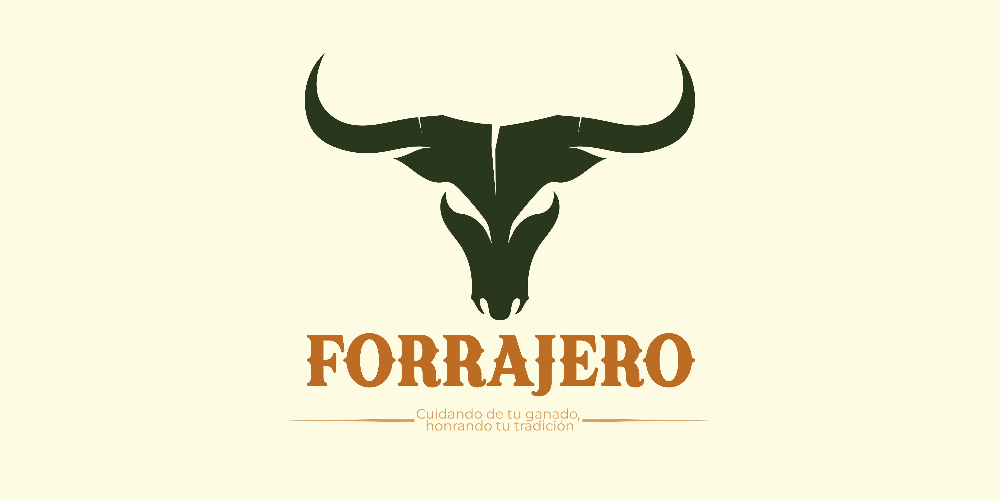

<table width="100%" border="0" cellspacing="0" cellpadding="0" style="width:100% !important; border-collapse:collapse; padding:0; margin:0; table-layout: fixed;">
  <tr style="padding:0; margin:0;">
    <td align="center" width="100%" style="width:100% !important; background-color: #f9f3dd; padding: 0 !important; margin: 0 !important;">
      <!-- La clave es width="100%" y style="width: 100% !important;" -->
      
    </td>
  </tr>
</table>

<!-- Un pequeño salto de línea para separar el banner del título -->
<br>

<h1 align="center">🐂 El Toro Forrajero</h1>

<p align="center">
    
    
    
</p>

<p align="center">
    <i>Ecosistema digital diseñado para democratizar el acceso a insumos de nutrición y soluciones logísticas especializadas en el sector pecuario.</i>
</p>

<hr style="border: 1px solid #ae825b;">

## 🌾 Visión General del Proyecto

**El Toro Forrajero** es una plataforma web intuitiva y de alto rendimiento que actúa como un ecosistema digital bilateral. Nuestro objetivo es conectar de manera directa a los proveedores de insumos pecuarios con productores, zootecnistas y pequeños negocios de distribución, eliminando barreras comerciales. 

Nuestro catálogo y logística se concentra en cuatro especies clave:
🐄 **Bovinos** | 🐖 **Porcinos** | 🐎 **Equinos** | 🐓 **Aves de Corral**

## 🎯 La Problemática y Propuesta de Valor (Enfoque CX)

<table align="center">
<tr>
<td width="50%" valign="top">
<b>🚧 El Problema en el Terreno</b><br><br>
Los pequeños y medianos productores en zonas rurales o semi-rurales enfrentan barreras críticas de distribución: tiendas especializadas lejanas, horarios sumamente limitados y una cadena de intermediarios costosa que encarece drásticamente los productos esenciales para sus animales.
</td>
<td width="50%" valign="top">
<b>✨ Nuestra Solución (La Propuesta)</b><br><br>
Ofrecemos un entorno digital transparente que rompe el aislamiento comercial mediante:
<ul>
    <li><b>Logística especializada:</b> Rediseño dinámico de entregas para mitigar el desabasto regional.</li>
    <li><b>Transparencia de precios:</b> Eliminación de intermediación opaca y tarifas especulativas.</li>
    <li><b>Asesoría técnica integrada:</b> Fichas técnicas, Q&A y consultas de optimización productiva.</li>
</ul>
</td>
</tr>
</table>

## 🛠️ Herramientas de Construcción (Tech Stack)

<div align="center">

| 🎨 Interfaz y Estilos (Frontend) | ⚙️ Lógica y Frameworks |
| :---: | :---: |
| <br/> | <br/> |

</div>

<p align="center">
    <i>Construido con estructura semántica pensada en SEO/Accesibilidad, diseño 100% responsivo y validaciones dinámicas del DOM en Vanilla JS.</i>
</p>

## 📂 Arquitectura del Directorio

```text
el-toro-forrajero/
├── css/
│   └── styles.css       # Estilos en cascada del proyecto
├── js/
│   └── scripts.js       # Interactividad y validaciones (Vanilla JS)
├── img/                 
│   └── logo-forrajero.jpg # Recursos gráficos y multimedia
├── index.html           # Punto de entrada de la plataforma
└── README.md            # Documentación
```
## 🤠 Equipo de Desarrollo: 404 Error Club

Este ecosistema digital fue planeado, diseñado y codificado por un equipo excepcional:

<table align="center">
    <tr>
        <td align="center"><a href="https://github.com/VanessaEstrada04"><br /><sub><b>Vanessa Estrada</b></sub></a></td>
        <td align="center"><a href="https://github.com/tobdany"><br /><sub><b>Daniela Tobón</b></sub></a></td>
        <td align="center"><a href="https://github.com/DianaH-314"><br /><sub><b>Diana Hurtado</b></sub></a></td>
    </tr>
    <tr>
        <td align="center"><a href="https://github.com/DIEGOELIASLOPEZ"><br /><sub><b>Elias López</b></sub></a></td>
        <td align="center"><a href="https://github.com/OscarAndres008"><br /><sub><b>Oscar Andrés</b></sub></a></td>
        <td align="center"><a href="https://github.com/KarenLunaS"><br /><sub><b>Karen Luna</b></sub></a></td>
    </tr>
    <tr>
        <td align="center"><a href="https://github.com/D-a-v-i-d-Vargas"><br /><sub><b>David Vargas</b></sub></a></td>
        <td align="center"><a href="https://github.com/eanila"><br /><sub><b>Esther Nila</b></sub></a></td>
        <td align="center"><a href="https://github.com/natalia-susana"><br /><sub><b>Natalia Susana</b></sub></a></td>
    </tr>
</table>

## Comando Instalar Dependencias
```text
npm install gulp
```
```text
npm install json-server@0.17.4
```

## Comando para ejecutar el codigo
```text
npm run dev
```


